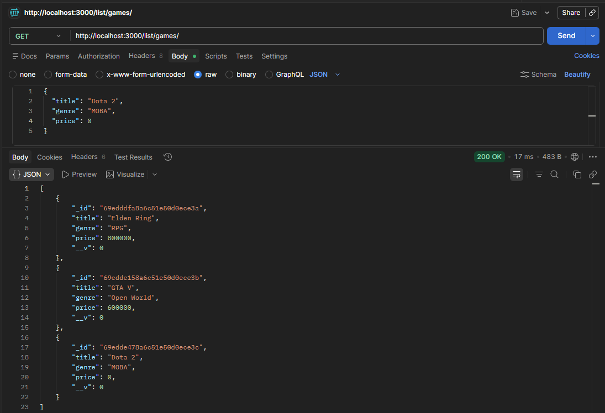
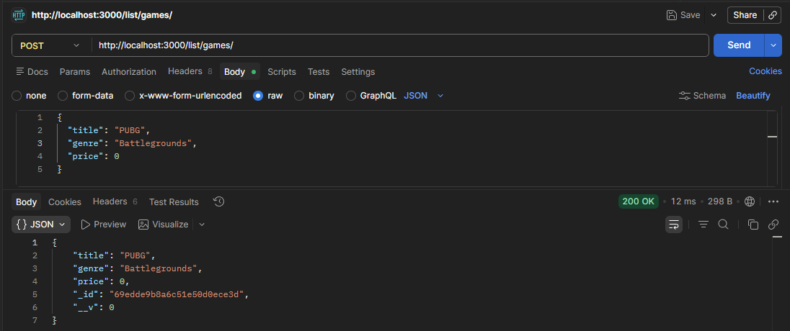
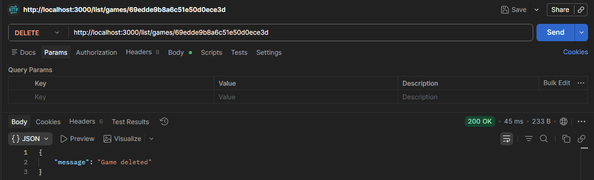
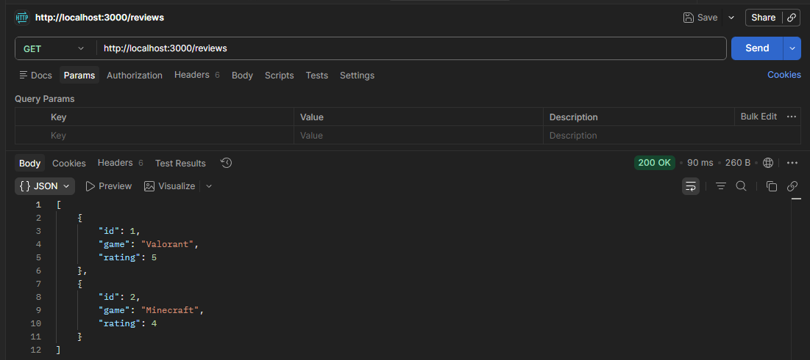
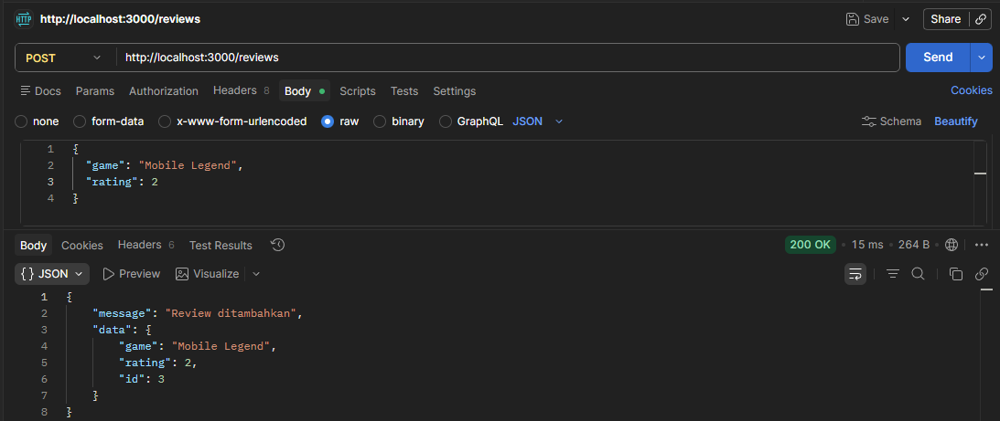
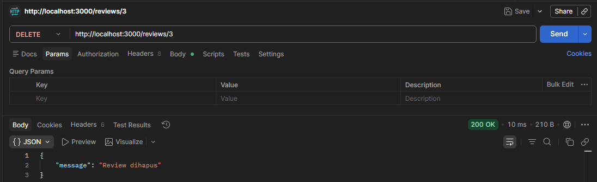

# API Gateway Node.js + PHP

## Identitas

|           |                       |
| --------- | ----------------------|
| **Nama**  | Muhammad Syahrul Pane |
| **NIM**   | 2410511078            |
| **Kelas** | SE2 B                 |

---

## Deskripsi Sistem

Project ini merupakan implementasi API Gateway lintas bahasa menggunakan:

* Node.js (Express) sebagai API Gateway (port 3000)
* Service 1 (Node.js + MongoDB) sebagai layanan Game
* Service 2 (PHP) sebagai layanan Review

## Daftar Endpoint

### Game Service (Node.js - MongoDB)

| METHOD | ENDPOINT              | DESKRIPSI                       |
| ------ | ----------------------| ------------------------------- |
| GET    | /games                | Ambil semua game                |
| POST   | /games                | Tambah game                     |
| DELETE | /games/:id            | Hapus game berdasarkan id       |

---

### Review Service (PHP)

| METHOD | ENDPOINT              | DESKRIPSI                         |
| ------ | ----------------------| --------------------------------- |
| GET    | /reviews              | Ambil semua review                |
| POST   | /reviews              | Tambah review                     |
| DELETE | /reviews/:id          | Hapus review berdasarkan id       |

---

## Cara Menjalankan

### 1. Jalankan Service 1 (Node.js)

```bash
node service1/service1.js
```

---

### 2. Jalankan Service 2 (PHP)

```bash
php -S localhost:3002 -t service2
```

---

### 3. Jalankan API Gateway

```bash
node gateaway.js
```

---

## Cara Testing (Postman)

### Game Service

* GET - http://localhost:3000/list/games
* POST - http://localhost:3000/list/games
* POST BODY

**Body (JSON):**
```json
{
  "title": "PUBG",
  "genre": "Battlegrounds",
  "price": 0
}
```
* DELETE - http://localhost:3000/list/games/{id}


### Review Service

* GET - http://localhost:3000/reviews
* POST - http://localhost:3000/reviews
* POST BODY

**Body (JSON):**
```json
{
  "game": "Mobile Legend",
  "rating": 2
}
```
* DELETE - http://localhost:3000/reviews/{id}

---

## Screenshot

* 
* 
* 
* 
* 
* 

---